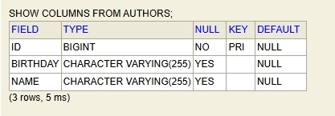
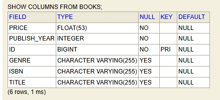
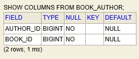
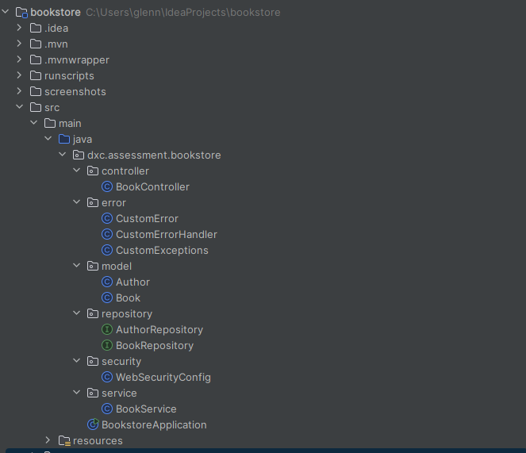

#### Documentation for BookStore Application [V.1]


---

### 1. Introduction

- The **Bookstore API** was developed following the instructions provided by DXC.

- Purpose of the application is to expose API to allow Add/Update/Fetch/Delete of Books with authors

- As there is no UI frontend included, a messaging tool such as Postman will be required for testing the API.

- The project is a **Maven Java Project** built with the following libraries and frameworks:
  
  - **Spring Web Starter**
  - **Spring Data JPA**
  - **Spring Web Security**
  - **Hibernate**
  - **H2 In-Memory Database**

### 2. Design Considerations

- **Spring Web Starter** was selected to utilize the REST Controller framework, enabling testing with frontend applications or messaging tools like Postman. This choice was made since the view layer is not part of the project requirements.

- **Spring Boot** includes an embedded Tomcat server, eliminating the need for a separate web container.

- **Spring Data JPA** was incorporated to simplify database interactions and manage entities, allowing for seamless integration with various relational databases through the JPA (Java Persistence API). This minimizes boilerplate code for data access.

- **Hibernate**, as the default implementation of JPA, provides powerful ORM (Object-Relational Mapping) capabilities, facilitating the mapping of Java objects to database tables and enhancing performance through features like caching and lazy loading.

- **H2** was chosen as the in-memory database for development and testing purposes. Its lightweight nature and easy setup allow for rapid prototyping and testing without the overhead of managing a separate database server.

### 

### 3. **Environment Setup**

- **Objective**: Set up for Bookstore API .

- **Steps**:
  
     1. **Install JDK 17**.
     
     2. **Configure environment variables** for Java.
     
     3. **Clone the repository** for the Bookstore Project from the GitHub repository (the current one you are viewing) to your local directory.
     
     4. Go to /runscripts dir and run mvn-clean-package.bat to validate,, compile, test, and package the project into a JAR file (`bookstore-Ver.1.jar`), which will be located in the `/target` directory in the root folder.
     
     5. Sure firesure test reports will be generate in /target/sure-fire-report to view unit test results for BookController Rest API during the mvn test lifecycle
     
     6. You can run mvn-clean-package.bat in /runscripts to test and generate surefire reports without running previous phases in mvn lifecycle 

### 4. Data Structure

The **Book** object is represented in JSON format as follows:

```
{ "isbn": "A0001", "title": "Cinderella", "publishYear": 1812, "price": 29.99, "genre": "Fiction", "authors": [ { "name": "Jacob Grimm", "birthday": "1785-01-04" }, { "name": "Wilhelm Grimm", "birthday": "1785-02-24" } ] }
```

#### Attributes:

- **isbn**: A unique identifier for the book, represented as a string (e.g., "A0001").

- **title**: The title of the book, represented as a string (e.g., "Cinderella").

- **publishYear**: The year the book was published, represented as an integer (e.g., 1812).

- **price**: The price of the book, represented as a decimal number (e.g., 29.99).

- **genre**: The genre of the book, represented as a string (e.g., "Fiction").

- **authors**: An array of author objects, each containing:
  
  - **name**: The name of the author, represented as a string (e.g., "Jacob Grimm").
  - **birthday**: The author's birth date, represented as a string in ISO 8601 format (e.g., "1785-01-04").
  - 

The **Author** object is represented in JSON format as follows:

```
{ "name": "Jacob Grimm", "birthday": "1785-01-04" }
```

#### Description:

- The **authors** attribute allows for the inclusion of multiple authors for a single book, enabling richer data representation and accommodating works that may have more than one contributor.

### 5. Database Schemas

### AUTHORS Table



- **Fields**:
  - `ID` (BIGINT): Primary key, non-nullable.
  - `BIRTHDAY` (VARCHAR(255)): Nullable, stores the author's birth date.
  - `NAME` (VARCHAR(255)): Nullable, holds the author's name.
- **Description**: This table represents authors with unique IDs and optionally stores additional information such as name and birthday.

### BOOK Table



**Fields**:

- - `PRICE` (FLOAT(53)): Non-nullable, indicates the book's price.
  - `PUBLISH_YEAR` (INTEGER): Non-nullable, stores the year of publication.
  - `ID` (BIGINT): Primary key, non-nullable.
  - `GENRE`, `ISBN`, `TITLE` (VARCHAR(255) each): Nullable, representing genre, ISBN, and title respectively.
- **Description**: This table holds information about each book, with a unique `ID` and other attributes such as price, publish year, genre, ISBN, and title. It connects to authors through the `BOOK_AUTHOR` join table.

These tables work together to support a database structure that models books and authors, handling many-to-many relationships effectively with `BOOK_AUTHOR` acting as the link between `BOOKS` and `AUTHORS`.

### BOOK_AUTHOR Table



- **Fields**:
  - `AUTHOR_ID` (BIGINT): Foreign key, non-nullable, referencing the `ID` field in the `AUTHORS` table.
  - `BOOK_ID` (BIGINT): Foreign key, non-nullable, referencing the `ID` field in the `BOOKS` table.
- **Description**: This is a join table for establishing a many-to-many relationship between books and authors. Each entry links one author to one book, allowing a book to have multiple authors and an author to contribute to multiple books.

### 6. Code Structure



#### Controller package

- Contains BookController.java, the main entry point for handling Restful Request according to uri mapping which are defined to Bookstore requirement

#### Error package

- Contains CustomError class which is the base error class responsible for http response payload during runtime exceptions 
- CustomExceptions class defines all custom exception types inherited from RuntimeException class
- CustomExceptionHander class contains the event handler to process the exception and populate CustomError to return

#### Model package

- Contains Book class, the main data object to perform CRUD 

- Contains Author class, the member data object to perform CRUD

#### Repository package

- Contains the DAO for Authors and Books

#### Security package

- Contains WebSecurityConfig class to define security settings such as ACL, CSRF, Authentication check, user/admin account settings

#### Service package

- Contains BookService which is used in BookController class to handle incoming requests payload and business logic


### 7. Testing

**Objective**: Step-by-Step Instructions for testing

-  Refer to Test Manual PDF located in the root folder where this README.MD is located to perform tests with expected results.  
